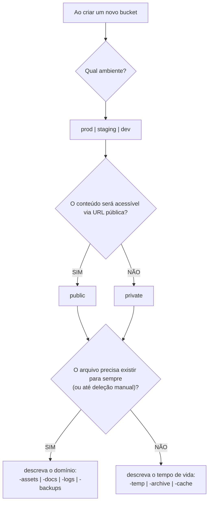

# [ADR-0011]: Padronização da Nomenclatura de Buckets S3

## Dados

- **Status:** 🔵 Em Uso
- **Data:** 2026-05-23
- **Proponentes:** [Allber Ferreira](https://github.com/AFSFerreira)

---

## Contexto e Problema

O MissionApp Backend utiliza o Amazon S3 como solução de armazenamento de objetos para diferentes categorias de arquivos: fotos de perfil de missionários e pastores, logos e banners de agências missionárias, imagens de posts, documentos de projetos de impacto e campanha, relatórios PDF gerados sob demanda, logs de aplicação e backups de banco de dados.

À medida que o projeto cresce e novos colaboradores ingressam, o time de infraestrutura enfrenta um problema crescente de **governança**: sem uma convenção de nomenclatura explícita, cada bucket criado ad hoc resulta em nomes arbitrários (`missionapp-fotos`, `imagens-prod`, `docs-temp-new`, `backup-final2`). Isso gera as seguintes dores operacionais:

- **Ambiguidade de ambiente:** Não é possível distinguir, pelo nome, se um bucket pertence à produção, ao staging ou ao ambiente de testes — abrindo margem para que scripts automatizados operem no ambiente errado.

- **Ambiguidade de visibilidade:** Não é possível inferir, pelo nome, se o conteúdo do bucket é público (acessível via URL) ou privado (restrito a roles IAM) — o que dificulta auditorias de segurança e revisões de política de acesso.

- **Incapacidade de automação de lifecycle:** AWS Lifecycle Rules e scripts Terraform dependem de padrões de nome previsíveis para aplicar regras de expiração automática. Sem uma convenção de sufixo para dados temporários, arquivos efêmeros como relatórios PDF gerados sob demanda acumulam custo indefinidamente por não terem uma regra de deleção aplicável.

- **Ausência de unicidade global garantida:** Nomes de buckets S3 são globalmente únicos na AWS — nenhum outro cliente AWS no mundo pode ter um bucket com o mesmo nome. Nomes genéricos como `assets` ou `uploads` já foram registrados por outros e estão indisponíveis; nomes específicos e padronizados com prefixo organizacional resolvem esse problema estruturalmente.

- **Dificuldade de navegação no console AWS:** O console da AWS lista buckets em ordem alfabética. Sem agrupamento por prefixo, toda a infraestrutura de storage aparece misturada, dificultando auditoria e operação.

A questão central é: **como nomear buckets S3 de forma que ambiente, visibilidade e ciclo de vida de cada recurso sejam imediatamente legíveis pelo nome, sem consultar documentação externa?**

## Decisão

Adotaremos a seguinte fórmula estrita de nomenclatura para todos os buckets S3 do MissionApp:

```
missionapp-{ambiente}-{visibilidade}-{proposito-ou-ciclo}
```

### Segmentos da fórmula

<table width="100%">
   <colgroup>
      <col width="20%">
      <col width="25%">
      <col width="55%">
   </colgroup>
   <thead>
      <tr>
         <th>Segmento</th>
         <th>Valores válidos</th>
         <th>Significado</th>
      </tr>
   </thead>
   <tbody>
      <tr>
         <td align="left"><code>missionapp</code></td>
         <td align="left">fixo</td>
         <td align="left">Prefixo organizacional. Garante unicidade global e agrupa todos os buckets do projeto no console AWS.</td>
      </tr>
      <tr>
         <td align="left"><code>{ambiente}</code></td>
         <td align="left"><code>prod</code> · <code>staging</code> · <code>dev</code></td>
         <td align="left">Ambiente de execução. Isola recursos entre produção, homologação e desenvolvimento.</td>
      </tr>
      <tr>
         <td align="left"><code>{visibilidade}</code></td>
         <td align="left"><code>public</code> · <code>private</code></td>
         <td align="left">Política de acesso. <code>public</code> = acessível via URL pública; <code>private</code> = restrito a roles IAM.</td>
      </tr>
      <tr>
         <td align="left"><code>{proposito-ou-ciclo}</code></td>
         <td align="left">ver tabelas abaixo</td>
         <td align="left">Identidade funcional do bucket: o que contém e/ou até quando deve existir.</td>
      </tr>
   </tbody>
</table>

---

### Sufixos por propósito — dados permanentes

Use quando os arquivos **não têm data de expiração** e devem ser gerenciados manualmente:

<table width="100%">
   <colgroup>
      <col width="20%">
      <col width="80%">
   </colgroup>
   <thead>
      <tr>
         <th>Sufixo</th>
         <th>O que armazena no contexto do MissionApp</th>
      </tr>
   </thead>
   <tbody>
      <tr>
         <td align="left"><code>-assets</code></td>
         <td align="left">Mídias estáticas consumidas pela interface: fotos de perfil de missionários e pastores, logos e banners de agências, imagens de posts e campanhas.</td>
      </tr>
      <tr>
         <td align="left"><code>-docs</code></td>
         <td align="left">Documentos oficiais com valor jurídico ou burocrático: contratos, termos de adesão, comprovantes de doação, identidades de membros.</td>
      </tr>
      <tr>
         <td align="left"><code>-logs</code></td>
         <td align="left">Arquivos de texto gerados pela aplicação: logs de erro da API AdonisJS, logs de acesso, registros de auditoria.</td>
      </tr>
      <tr>
         <td align="left"><code>-backups</code></td>
         <td align="left">Dumps do banco de dados PostgreSQL gerados por scripts automatizados de segurança.</td>
      </tr>
   </tbody>
</table>

### Sufixos por ciclo de vida — dados temporários

Use quando os arquivos **têm data de validade** e devem ser apagados automaticamente via AWS Lifecycle Rules:

<table width="100%">
   <colgroup>
      <col width="15%">
      <col width="20%">
      <col width="65%">
   </colgroup>
   <thead>
      <tr>
         <th>Sufixo</th>
         <th>TTL sugerido</th>
         <th>O que armazena no contexto do MissionApp</th>
      </tr>
   </thead>
   <tbody>
      <tr>
         <td align="left"><code>-temp</code></td>
         <td align="left">24h - 7 dias</td>
         <td align="left">Relatórios PDF gerados sob demanda, uploads de rascunho, exports temporários de dados.</td>
      </tr>
      <tr>
         <td align="left"><code>-archive</code></td>
         <td align="left">indefinido (Glacier)</td>
         <td align="left">Documentos que não podem ser apagados por exigência legal mas que ninguém acessa no dia a dia — armazenados na classe Glacier (90% mais barato).</td>
      </tr>
      <tr>
         <td align="left"><code>-cache</code></td>
         <td align="left">variável</td>
         <td align="left">Arquivos derivados que podem ser recriados: thumbnails pré-processados, versões redimensionadas de imagens.</td>
      </tr>
   </tbody>
</table>

---

### Matriz de infraestrutura do MissionApp

<table width="100%">
   <colgroup>
      <col width="30%">
      <col width="12%">
      <col width="12%">
      <col width="12%">
      <col width="34%">
   </colgroup>
   <thead>
      <tr>
         <th>Bucket</th>
         <th>Ambiente</th>
         <th>Visibilidade</th>
         <th>Ciclo</th>
         <th>O que guarda</th>
      </tr>
   </thead>
   <tbody>
      <tr>
         <td align="left"><code>missionapp-prod-public-assets</code></td>
         <td align="left">Produção</td>
         <td align="left">Público</td>
         <td align="left">Permanente</td>
         <td align="left">Fotos de perfil, logos de agências, imagens de posts e campanhas.</td>
      </tr>
      <tr>
         <td align="left"><code>missionapp-prod-private-docs</code></td>
         <td align="left">Produção</td>
         <td align="left">Privado</td>
         <td align="left">Permanente</td>
         <td align="left">Contratos, comprovantes de doação, documentos de projetos de impacto.</td>
      </tr>
      <tr>
         <td align="left"><code>missionapp-prod-private-backups</code></td>
         <td align="left">Produção</td>
         <td align="left">Privado</td>
         <td align="left">Permanente</td>
         <td align="left">Dumps diários do PostgreSQL.</td>
      </tr>
      <tr>
         <td align="left"><code>missionapp-prod-private-logs</code></td>
         <td align="left">Produção</td>
         <td align="left">Privado</td>
         <td align="left">Permanente</td>
         <td align="left">Logs da API AdonisJS.</td>
      </tr>
      <tr>
         <td align="left"><code>missionapp-prod-private-temp</code></td>
         <td align="left">Produção</td>
         <td align="left">Privado</td>
         <td align="left">7 dias</td>
         <td align="left">Relatórios PDF gerados por missionários e pastores.</td>
      </tr>
      <tr>
         <td align="left"><code>missionapp-prod-private-archive</code></td>
         <td align="left">Produção</td>
         <td align="left">Privado</td>
         <td align="left">Glacier</td>
         <td align="left">Documentos de membros inativos com retenção legal.</td>
      </tr>
      <tr>
         <td align="left"><code>missionapp-staging-public-assets</code></td>
         <td align="left">Staging</td>
         <td align="left">Público</td>
         <td align="left">Permanente</td>
         <td align="left">Imagens usadas em testes de homologação.</td>
      </tr>
      <tr>
         <td align="left"><code>missionapp-staging-public-temp</code></td>
         <td align="left">Staging</td>
         <td align="left">Público</td>
         <td align="left">1 dia</td>
         <td align="left">Uploads de rascunho em pipelines de testes automatizados.</td>
      </tr>
   </tbody>
</table>

---

### Fluxograma de decisão para novos buckets



## Justificativa

- **Legibilidade imediata:** O nome do bucket responde às três perguntas de governança — _qual ambiente?_, _quem pode acessar?_, _até quando?_ — sem necessidade de consultar documentação externa ou tags de recurso. Qualquer engenheiro consegue auditar a infraestrutura apenas lendo a lista de buckets.

- **Automação de Lifecycle Rules via sufixo:** AWS Lifecycle Rules e scripts Terraform podem aplicar regras de expiração com um filtro de sufixo (`*-temp`, `*-archive`). Isso torna a governança de custos automatizável: uma única regra no Terraform cobre todos os buckets temporários presentes e futuros, independentemente de quantas aplicações os criem.

- **Unicidade global garantida pelo prefixo organizacional:** O prefixo `missionapp-` reduz drasticamente a probabilidade de colisão de nomes no namespace global da AWS, eliminando a necessidade de adicionar sufixos aleatórios (`-a3f9`, `-v2`) que tornam os nomes ilegíveis.

- **Agrupamento natural no console AWS:** O console lista buckets em ordem alfabética. Com o prefixo `missionapp-`, toda a infraestrutura de storage do projeto aparece agrupada, e o segundo segmento (`prod` vs `staging`) separa ambientes visualmente.

- **Prevenção de erros de ambiente:** Scripts automatizados que operam em buckets `-temp` do `staging` jamais apagarão dados de `prod` por engano — o ambiente está codificado no nome, não apenas em variáveis de ambiente que podem ser injetadas incorretamente.

- **Convergência com práticas de mercado:** A fórmula `{org}-{env}-{visibility}-{purpose}` é o padrão documentado por equipes de infraestrutura de empresas como HashiCorp, Datadog e Netflix em guias públicos de boas práticas de S3.

## Alternativas Consideradas

- **Nenhuma convenção formal (nomes livres):** Cada colaborador nomeia buckets conforme sua intuição. Resulta nos problemas descritos no Contexto — ambiguidade de ambiente, impossibilidade de automação e dificuldade de auditoria. Descartado.

- **Tags AWS no lugar de nomenclatura estruturada:** Usar tags (`Environment: prod`, `Visibility: private`) em vez de codificar essas informações no nome. Tags são poderosas para billing e IAM, mas não eliminam a necessidade de um nome legível — o nome ainda aparece nas listas, nos logs e nos erros de aplicação. Tags e nomenclatura estruturada são complementares, não substitutos. Descartado como abordagem exclusiva.

- **Prefixo com ID de conta AWS (`{account-id}-{purpose}`):** Alguns times usam o ID numérico da conta AWS no prefixo para garantir unicidade. IDs numéricos são opacos, não carregam contexto organizacional e dificultam a leitura humana. Descartado.

- **Fórmula sem o segmento de visibilidade (`{org}-{env}-{purpose}`):** Simplifica o nome mas perde a informação de visibilidade (público vs. privado) imediatamente legível. Em um projeto com dados sensíveis de missionários e documentos jurídicos, esse segmento é crítico para auditorias de segurança. Descartado.

## Consequências (Trade-offs)

### Positivas / Benefícios

- **Governança de custos automatizável:** Lifecycle Rules aplicadas por sufixo (`*-temp`) cobrem toda a infraestrutura presente e futura sem configuração adicional por bucket. Arquivos temporários como relatórios PDF nunca mais acumularão custo indefinidamente.

- **Auditoria de segurança simplificada:** Qualquer revisão de política de acesso pode filtrar imediatamente por `*-public-*` para verificar quais buckets expõem conteúdo publicamente, sem precisar inspecionar as ACLs de cada bucket individualmente.

- **Onboarding de infraestrutura acelerado:** Novos colaboradores entendem a topologia de storage do projeto lendo a lista de buckets — sem precisar de documentação adicional para saber o que cada bucket contém ou a quem pertence.

- **Eliminação de colisões de nome:** O prefixo organizacional garante que o projeto possa criar buckets sem se preocupar com conflitos de namespace global.

- **Scripts Terraform e CI/CD mais simples:** Módulos de infraestrutura podem gerar nomes de buckets programaticamente a partir de variáveis (`var.env`, `var.visibility`, `var.purpose`), sem hardcode de nomes arbitrários.

### Negativas / Riscos

- **Nomes mais longos:** `missionapp-prod-private-docs` tem 28 caracteres. O limite da AWS é 63. Para projetos com prefixos organizacionais muito longos, o segmento de propósito pode precisar ser abreviado.

- **Custo de migração de buckets existentes:** Buckets S3 não podem ser renomeados na AWS — é necessário criar um novo bucket com o nome correto, migrar o conteúdo via `aws s3 sync`, atualizar todas as referências no código e no Terraform, e deletar o bucket antigo. Qualquer bucket criado antes desta decisão exigirá esse processo.

- **Disciplina de equipe:** A convenção só funciona se todos os colaboradores a seguirem. Um único bucket criado fora do padrão quebra a legibilidade e pode escapar das Lifecycle Rules automáticas. Recomenda-se adicionar validação de nomenclatura no pipeline de CI (ex: checklist de PR ou script de lint de Terraform).

- **Não cobre buckets de terceiros:** Integrações com serviços externos (ex: Stripe, Resend) podem criar ou referenciar buckets com nomes fora do controle do projeto. Essa convenção se aplica apenas a buckets gerenciados diretamente pelo time do MissionApp.

## Referências

- [Amazon S3 — Bucket naming rules](https://docs.aws.amazon.com/AmazonS3/latest/userguide/bucketnamingrules.html): regras oficiais de nomenclatura que fundamentam a convenção adotada
- [AWS S3 Lifecycle configuration](https://docs.aws.amazon.com/AmazonS3/latest/userguide/object-lifecycle-mgmt.html): políticas de ciclo de vida que orientam a separação por bucket de propósito
- [Amazon S3 Glacier storage classes](https://aws.amazon.com/s3/storage-classes/glacier/): classe de storage de baixo custo para arquivos de longa retenção
- [Terraform AWS S3 Bucket resource](https://registry.terraform.io/providers/hashicorp/aws/latest/docs/resources/s3_bucket): referência de IaC para provisionamento dos buckets em produção
