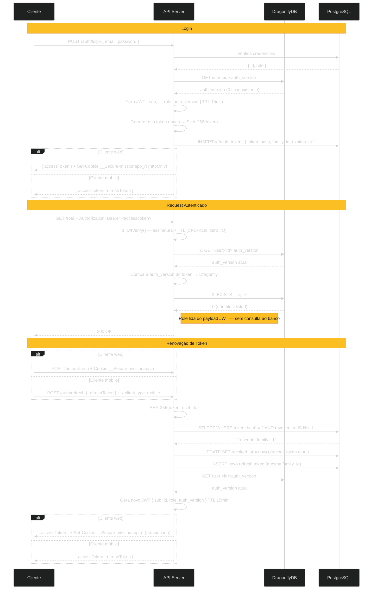

# [ADR-0020]: Estratégia de Autenticação: JWT Híbrido com Revogação via DragonflyDB

## Dados

- **Status:** 🔵 Em Uso
- **Data:** 2026-06-14
- **Proponentes:** [Allber Ferreira](https://github.com/AFSFerreira)

---

## Contexto e Problema

O MissionApp precisa de uma estratégia de autenticação que equilibre quatro requisitos que entram em tensão direta entre si:

**Revogação imediata de acesso (NF.1.3 — LGPD):**
O sistema armazena dados de afiliação religiosa, classificados como dados sensíveis pelo Art. 11 da LGPD. O titular tem direito à exclusão de dados e à revogação de consentimento a qualquer momento. Um token de acesso que permanece válido por horas após a solicitação de exclusão de conta é uma não-conformidade legal, não apenas uma falha técnica. O mesmo se aplica a contas de missionários reprovadas ou suspensas após aprovação (Req. 1.3, Req. 3.4): o acesso deve ser cortado imediatamente.

**Escalabilidade para picos de tráfego (NF.2.5 + NF.5.1):**
O sistema deve suportar 1.000 usuários simultâneos sem degradação superior a 20% no tempo de resposta. Domingos e cultos são janelas de alto tráfego previsíveis — feeds, contadores e projetos curados são acessados simultaneamente por uma grande base de usuários. A estratégia de autenticação deve escalar horizontalmente sem impor acoplamento entre as réplicas da aplicação.

**Operação em contexto mobile-first (NF.6.1):**
Missionários operam majoritariamente em campo, com acesso pelo celular. Clientes nativos (React Native, Flutter) não possuem cookie jar gerenciado pelo browser — cookies httpOnly exigem bibliotecas adicionais e configuração manual em cada plataforma, enquanto tokens no header `Authorization` são o padrão idiomático do OAuth 2.0 e de toda biblioteca HTTP mobile. A estratégia deve funcionar naturalmente em ambos os contextos sem impor overhead desnecessário ao cliente mobile.

**Segurança de conta em operações financeiras:**
O sistema intermedia doações financeiras entre apoiadores e missionários. Dispositivos comprometidos ou credenciais vazadas precisam de revogação imediata. A troca de senha deve invalidar todas as sessões ativas simultaneamente, não apenas a sessão corrente.

A questão central é: **qual estratégia de autenticação atende simultaneamente à conformidade LGPD, à escalabilidade horizontal, ao contexto mobile e à segurança de operações financeiras do MissionApp?**

## Decisão

Adotaremos **autenticação JWT híbrida** com dois tipos de token e revogação via DragonflyDB.

### Access Token (JWT — curta duração)

Token JWT assinado com HS256, emitido a cada login ou renovação, com TTL de 15 minutos. O payload carrega:

- `sub` — ID do usuário
- `jti` — UUID v7 único por token, utilizado para revogação individual
- `auth_version` — contador de versão do usuário, utilizado para revogação global
- `role` — role do usuário no momento da emissão (`ADMIN`, `MISSIONARY` ou `SUPPORTER`), utilizado para autorização sem consulta ao banco

Incluir a `role` no payload elimina o round-trip ao banco ou cache em cada verificação de permissão. A segurança é preservada pelo mecanismo de `auth_version`: qualquer alteração de role deve incrementar o contador, invalidando imediatamente todos os tokens emitidos com a role anterior.

A validação é realizada em três passos por request autenticado: verificação criptográfica da assinatura (`jwtVerify`), verificação da `auth_version` ativa no DragonflyDB e verificação da presença do `jti` na blocklist do DragonflyDB. Todas são operações O(1) — a primeira é CPU-local, as duas seguintes são `GET`s independentes no DragonflyDB.

### Refresh Token (opaco — longa duração)

Token opaco gerado com `crypto.randomBytes(64)`, com TTL de 7 dias. Armazenado no PostgreSQL como hash SHA-256 — o valor bruto nunca é persistido. Cada registro carrega:

- `token_hash` — hash SHA-256 do valor bruto
- `family_id` — UUID que agrupa todos os tokens de uma mesma sessão de login, utilizado para detecção de roubo via refresh token rotation
- `expires_at` — expiração absoluta
- `revoked_at` — `null` enquanto válido; preenchido na revogação

A cada uso, o refresh token é rotacionado: o token apresentado é revogado e um novo é emitido na mesma família. Se um token já revogado for apresentado, toda a família é invalidada imediatamente — técnica conhecida como _refresh token rotation with family tracking_.

### Mecanismos de Revogação no DragonflyDB

**Revogação individual (logout em um dispositivo):**
O `jti` do access token corrente é adicionado ao DragonflyDB com TTL igual ao tempo restante de validade do token. A cada request, o guard verifica a existência da chave `jti:<valor>` antes de autenticar.

**Revogação global (troca de senha, alteração de role, suspenção de conta):**
Um contador por usuário (`user:<id>:auth_version`) é incrementado no DragonflyDB. O payload do JWT carrega o valor da `auth_version` no momento da emissão. Se o valor no token divergir do valor atual no Dragonfly, o request é rejeitado — todos os tokens de todas as sessões ativas são invalidados instantaneamente, sem necessidade de enumerar os `jti`s emitidos. Isso garante que uma alteração de role nunca seja lida a partir de um token desatualizado.

### Entrega dos Tokens por Tipo de Cliente

O servidor distingue clientes pelo header `x-client-type: mobile`. A ausência do header é interpretada como cliente web.

**Cliente web (browser):**
O refresh token não aparece no body da resposta — é setado diretamente em um cookie `httpOnly` com o nome `__Secure-missionapp_rt`. O cookie carrega os atributos `Secure`, `SameSite=Strict` e `Path=/api/v1/auth/refresh`, restringindo sua transmissão exclusivamente à rota de renovação. O prefixo `__Secure-` é um mecanismo do protocolo HTTP que impõe a rejeição do cookie pelo browser se a resposta não vier de uma conexão HTTPS. O access token é retornado no body e armazenado em memória pelo frontend — não em `localStorage`.

**Cliente mobile (app nativo):**
O refresh token é retornado no body junto com o access token. O app armazena ambos no storage seguro do sistema operacional: Keychain no iOS, Keystore no Android. JavaScript não está envolvido, portanto o vetor XSS não se aplica.

### Fluxo Consolidado

```bash
Login:
  Valida credenciais → carrega { id, role } do usuário
  Emite access token JWT (15 min) com payload { sub, jti, role, auth_version }
  Emite refresh token opaco (7 dias) → armazena hash SHA-256 no PostgreSQL
  Web:    refresh token → cookie __Secure-missionapp_rt (httpOnly, Secure, SameSite=Strict,
          Path=/api/v1/auth/refresh); access token → body
  Mobile: ambos → body; cliente armazena no Keychain (iOS) / Keystore (Android)

Request autenticado:
  Authorization: Bearer <access_token>
  Guard (3 passos, todos O(1)):
    1. jwtVerify() [CPU-local] — valida assinatura e expiração
    2. GET user:<id>:auth_version [Dragonfly] — rejeita se divergir do payload
    3. EXISTS jti:<jti> [Dragonfly] — rejeita se token estiver na blocklist
  Role extraída do payload JWT — sem consulta ao banco para autorização

Access token expirado:
  POST /api/v1/auth/refresh
  Web:    cookie __Secure-missionapp_rt enviado automaticamente pelo browser
  Mobile: { refreshToken } no body + header x-client-type: mobile
  Servidor: SHA-256(token recebido) → busca no banco → valida family_id
            → revoga token atual → emite novo refresh token (mesma família)
            → emite novo access token com role e auth_version atuais

Logout:
  SET jti:<jti> EX <ttl_restante> [Dragonfly] → bloqueia access token atual
  UPDATE refresh_tokens SET revoked_at = now() WHERE user_id = ? [PostgreSQL]
  Web: clearCookie(__Secure-missionapp_rt)

Troca de senha ou alteração de role:
  INCR user:<id>:auth_version [Dragonfly] → invalida todos os access tokens imediatamente
  UPDATE refresh_tokens SET revoked_at = now() WHERE user_id = ? [PostgreSQL]

Suspenção/reprovação de conta:
  Mesmo fluxo da troca de senha — acesso cortado na próxima request autenticada

Roubo de refresh token detectado (token revogado reutilizado):
  UPDATE refresh_tokens SET revoked_at = now() WHERE family_id = ? [PostgreSQL]
  → toda a família invalidada; ambas as partes forçadas a novo login com senha
```

### Diagrama de Sequência — Caminho Crítico



## Justificativa

**JWT puro (sem blocklist) é incompatível com a LGPD e com os requisitos de segurança:**
Um JWT com TTL de 2 horas não pode ser revogado antes da expiração natural. Para o MissionApp, isso significa que: (1) um usuário que solicita exclusão de conta continua autenticado por até 2 horas — não-conformidade direta com o Art. 18 da LGPD; (2) um missionário suspenso após aprovação continua com acesso ativo pelo mesmo período; (3) um dispositivo comprometido com token ativo representa uma janela de exposição inaceitável em contexto que envolve transações financeiras. O requisito NF.1.3 não deixa espaço para tolerância nessa janela.

**Sessão stateful clássica impõe custos que o MissionApp não precisa pagar:**
Sessão stateful armazena estado para _todos_ os usuários ativos — cada request consulta o banco ou Redis para carregar a sessão. O MissionApp não possui o requisito de "uma sessão por vez por usuário" que justificaria esse custo em projetos SaaS com controle de licenciamento por assento. Além disso, sessão stateful em contexto mobile exige configuração explícita de cookie jar em cada cliente nativo, tornando a integração mais frágil e dependente de bibliotecas de terceiros.

**JWT híbrido captura o melhor dos dois modelos:**
O caminho crítico — cada request autenticado — é validado por operações O(1) sem tocar o PostgreSQL: verificação criptográfica local e um `GET` no DragonflyDB. A revogação existe, mas como exceção: a blocklist de `jti`s cresce apenas quando tokens são revogados antes da expiração, e a `auth_version` é um único campo por usuário. Em condições normais de operação, o banco relacional não é consultado em nenhum request de autenticação rotineiro.

**DragonflyDB já está no stack com custo de infra zero:**
O ADR-0003 adota o DragonflyDB para cache, rate limiting e broker de filas. A blocklist de `jti`s e os contadores de `auth_version` são mais dois usos do mesmo serviço — sem nova dependência, sem nova peça de infraestrutura para operar.

**Refresh token opaco no banco é o padrão da indústria para o modelo híbrido:**
Auth0, GitHub, Google OAuth 2.0 e a maioria dos grandes provedores de autenticação utilizam access token JWT de curta duração combinado com refresh token opaco de longa duração armazenado server-side. A razão é direta: o refresh token precisa ser revogável com garantia absoluta — o banco é autoritativo. O JWT para o access token elimina o lookup por request. A separação dos formatos é design deliberado, não inconsistência.

**Refresh token rotation com family tracking mitiga roubo de token:**
Independente de quem usa o token roubado primeiro, o mecanismo garante que ambas as partes perdem o acesso:

- **Usuário legítimo age primeiro:** usa RT_1 → recebe RT_2, RT_1 revogado. Atacante tenta RT_1 → servidor detecta reutilização de token revogado → invalida toda a família (RT_2 incluído) → ambos forçados a novo login com senha.
- **Atacante age primeiro:** usa RT_1 → recebe RT_2 (token do atacante), RT_1 revogado. Usuário legítimo tenta RT_1 → servidor detecta reutilização de token revogado → invalida toda a família (RT_2 do atacante incluído) → ambos forçados a novo login com senha.

Em ambos os cenários, o uso de um token já revogado é o gatilho da invalidação da família inteira. Sem rotation, um refresh token roubado seria utilizável pelo atacante até a expiração de 7 dias — sem que o servidor tivesse qualquer sinal de comprometimento.

**Distinção por `x-client-type` mantém a API unificada:**
Uma única API atende web e mobile sem endpoints separados. O header diferencia o comportamento de entrega do refresh token. A ausência do header assume web por padrão — comportamento mais seguro, pois o cookie httpOnly não expõe o token ao JavaScript.

**O modelo é estruturalmente resistente a XSS e CSRF:**

_XSS (Cross-Site Scripting):_ O vetor clássico de XSS contra autenticação é roubar um token persistido em `localStorage` e usá-lo para fazer requests em nome da vítima indefinidamente. A estratégia adotada remove esse vetor em duas camadas: o access token nunca é gravado em disco — reside apenas em memória JavaScript e expira em 15 minutos; o refresh token é protegido de forma adequada a cada contexto de cliente — no browser, via cookie `httpOnly` inacessível ao JavaScript por definição, independente de qual script seja injetado na página; no mobile, via Keychain (iOS) ou Keystore (Android), storages isolados por app e criptografados pelo sistema operacional, onde JavaScript sequer existe como superfície de ataque. Um ataque XSS bem-sucedido pode usar o access token durante sua janela de 15 minutos, mas não consegue renovar a sessão — sem o refresh token, a sessão termina na próxima expiração.

_CSRF (Cross-Site Request Forgery):_ CSRF explora o comportamento do browser de enviar cookies automaticamente em requests cross-origin. A estratégia adota duas defesas complementares: (1) todos os endpoints autenticados exigem o header `Authorization: Bearer <token>` — browsers não enviam headers customizados em requests cross-origin sem permissão CORS explícita, tornando esses endpoints imunes a CSRF por design; (2) o único cookie existente (`__Secure-missionapp_rt`) carrega `SameSite=Strict`, que instrui o browser a não enviar o cookie em nenhum request originado de domínio diferente — e `Path=/api/v1/auth/refresh`, restringindo a transmissão do cookie exclusivamente à rota de renovação de token. A combinação elimina a superfície de CSRF sem exigir tokens anti-CSRF adicionais.

## Alternativas Consideradas

**1. JWT puro sem blocklist**

Descartado. Incompatível com NF.1.3 (LGPD — revogação de acesso ao solicitar exclusão), com os requisitos de suspenção de contas (Req. 1.3, 3.4) e com a necessidade de revogação em caso de dispositivo comprometido em contexto de transações financeiras. A janela de exposição de 15 minutos a 2 horas é inaceitável para os dados e operações envolvidos.

**2. Sessão stateful clássica (cookie de sessão + tabela de sessões)**

Descartada. O MissionApp não possui o requisito de "uma sessão ativa por usuário" que justificaria o custo de consultar a tabela de sessões em cada request. Em contexto mobile-first, cookies de sessão exigem bibliotecas adicionais e configuração não-idiomática. A sessão stateful impõe lookup no banco em todo request autenticado — custo que o modelo híbrido elimina do caminho crítico.

**3. JWT com blocklist de `jti` sem `auth_version`**

Parcialmente descartada. A blocklist de `jti` por si só não resolve a revogação em troca de senha de forma eficiente: seria necessário inserir no DragonflyDB todos os `jti`s de todos os tokens ativos do usuário, cuja contagem não é conhecida pelo servidor. O campo `auth_version` resolve esse problema com um único `INCR` — invalidando todos os tokens ativos sem enumeração.

**4. Opaque tokens para access e refresh (sem JWT)**

Descartado. Tokens opacos para access token exigem lookup no banco em cada request autenticado — o mesmo custo da sessão stateful. O benefício de ter acesso token autocontido (zero I/O no caminho crítico) seria perdido. O modelo híbrido preserva esse benefício enquanto adiciona revogação.

**5. Cookie `__Host-` em vez de `__Secure-`**

Descartado para este caso. O prefixo `__Host-` proíbe o atributo `Path` e força `path=/`, tornando o cookie enviado para todos os endpoints da API — não apenas para `/api/v1/auth/refresh`. A restrição de `path` é uma camada de segurança relevante: reduz a superfície de transmissão do refresh token. O `__Secure-` preserva a restrição de `path` e impõe HTTPS sem proibir `domain`.

## Consequências (Trade-offs)

### Positivas / Benefícios

- **Conformidade com LGPD (NF.1.3):** Revogação imediata de acesso disponível em todos os cenários — logout, troca de senha, exclusão de conta, suspenção de conta. O mecanismo de `auth_version` corta o acesso na próxima request autenticada, não ao expirar o token.

- **Escalabilidade horizontal sem sticky sessions:** Nenhum estado de autenticação reside em memória do processo. DragonflyDB e PostgreSQL são compartilhados entre réplicas. O load balancer distribui requests livremente — não é necessário encaminhar o mesmo usuário sempre para a mesma instância.

- **Caminho crítico sem I/O no banco relacional:** Requests autenticados rotineiros não consultam o PostgreSQL. A `auth_version` é um `GET` no DragonflyDB. O banco é consultado apenas em eventos de baixa frequência: renovação do refresh token (a cada 15 minutos por usuário) e operações de revogação.

- **Suporte nativo a mobile e web com uma única API:** O header `x-client-type` diferencia o comportamento sem duplicar endpoints. Clientes mobile recebem o refresh token no body e o armazenam em storage seguro do SO. Clientes web recebem o refresh token em cookie httpOnly inacessível ao JavaScript.

- **Detecção de roubo de refresh token:** O mecanismo de rotation com `family_id` invalida automaticamente toda a linhagem da sessão comprometida quando um token revogado é reutilizado — sem intervenção manual e sem falso positivo para o usuário legítimo, que é forçado a fazer novo login com senha.

- **DragonflyDB reutilizado — zero adição de infraestrutura:** A blocklist de `jti`s e os contadores de `auth_version` são mais dois namespaces no DragonflyDB já em operação. Não há nova peça de infraestrutura para provisionar, monitorar ou manter.

### Negativas / Riscos

- **DragonflyDB no caminho crítico de autenticação:** Cada request autenticado faz um `GET` no DragonflyDB. Se o serviço estiver indisponível, o guard deve optar por _fail closed_ (rejeitar todos os requests) ou _fail open_ (aceitar todos os tokens válidos criptograficamente). Para o MissionApp, _fail closed_ é a posição segura dado o contexto de dados sensíveis e transações financeiras — mas impacta disponibilidade durante falha do DragonflyDB.

- **Janela de exposição de ≤ 15 minutos na troca de senha:** A `auth_version` invalida novos requests imediatamente, mas access tokens já emitidos e em uso em requests concorrentes naquele instante podem completar. Essa janela de até 15 minutos é a consequência direta do TTL curto e é considerada aceitável para os requisitos do MissionApp.

- **Complexidade operacional superior ao JWT puro:** A estratégia envolve três mecanismos distintos: JWT, DragonflyDB e tabela de refresh tokens no PostgreSQL. Contribuidores precisam compreender a interação entre os três para implementar corretamente cenários de autenticação, renovação e revogação.

- **Prefixo `__Secure-` exige HTTPS estrito:** Em ambiente de desenvolvimento local (HTTP), o browser ignora silenciosamente cookies com prefixo `__Secure-`. A constante que define o nome do cookie deve ser condicionada ao ambiente, usando `__Secure-missionapp_rt` em produção e `missionapp_rt` em desenvolvimento — conforme documentado na implementação.

- **Tabela de refresh tokens requer manutenção periódica:** Tokens expirados e revogados acumulam na tabela sem serem removidos automaticamente. Um job periódico de limpeza via BullMQ é necessário para evitar crescimento indefinido da tabela.

## Referências

- [RFC 6749](https://datatracker.ietf.org/doc/html/rfc6749): OAuth 2.0 Authorization Framework — base do modelo de tokens de acesso e atualização
- [RFC 7519](https://datatracker.ietf.org/doc/html/rfc7519): JSON Web Token (JWT) — especificação do formato e validação de access tokens
- [RFC 6265](https://datatracker.ietf.org/doc/html/rfc6265): HTTP State Management Mechanism — especificação de cookies e atributos `Secure`, `HttpOnly`, `SameSite`
- [MDN — Cookie prefixes](https://developer.mozilla.org/en-US/docs/Web/HTTP/Reference/Headers/Set-Cookie#cookie_prefixes): semântica e restrições dos prefixos `__Secure-` e `__Host-`
- [OWASP — Session Management Cheat Sheet](https://cheatsheetseries.owasp.org/cheatsheets/Session_Management_Cheat_Sheet.html): práticas de segurança para gestão de sessão e tokens
- [OWASP — XSS Prevention Cheat Sheet](https://cheatsheetseries.owasp.org/cheatsheets/Cross_Site_Scripting_Prevention_Cheat_Sheet.html): medidas de proteção contra XSS que fundamentam o uso de cookies httpOnly
- [OWASP — CSRF Prevention Cheat Sheet](https://cheatsheetseries.owasp.org/cheatsheets/Cross-Site_Request_Forgery_Prevention_Cheat_Sheet.html): medidas de proteção contra CSRF que fundamentam o uso de `SameSite=Strict`
- [MDN — Set-Cookie: SameSite](https://developer.mozilla.org/en-US/docs/Web/HTTP/Reference/Headers/Set-Cookie#samesitesamesite-value): comportamento de `SameSite=Strict` e proteção contra CSRF
- [RFC 9700 — seção 4.14](https://datatracker.ietf.org/doc/html/rfc9700#section-4.14): OAuth 2.0 Security Best Current Practice — base normativa para refresh token rotation e detecção de roubo via reuso de token revogado
- [Auth0 — Refresh Token Rotation](https://auth0.com/docs/secure/tokens/refresh-tokens/refresh-token-rotation): descrição aplicada do mecanismo de rotation with family tracking
- [LGPD Art. 11](https://www.planalto.gov.br/ccivil_03/_ato2015-2018/2018/lei/l13709.htm): dados pessoais sensíveis — fundamento legal para revogação imediata de acesso
- [LGPD Art. 18](https://www.planalto.gov.br/ccivil_03/_ato2015-2018/2018/lei/l13709.htm): direitos do titular — inclui direito à exclusão e revogação de consentimento
- [ADR-0003](./0003-adocao-do-dragonfly-como-cache-e-armazenamento-temporario.md): decisão de adoção do DragonflyDB — justifica seu uso como armazenamento da blocklist e contadores de `auth_version`
- [ADR-0017 — Adoção de UUID v7 como Estratégia de Chave Primária](./0017-adocao-de-uuid-v7-como-estrategia-de-chave-primaria.md)
