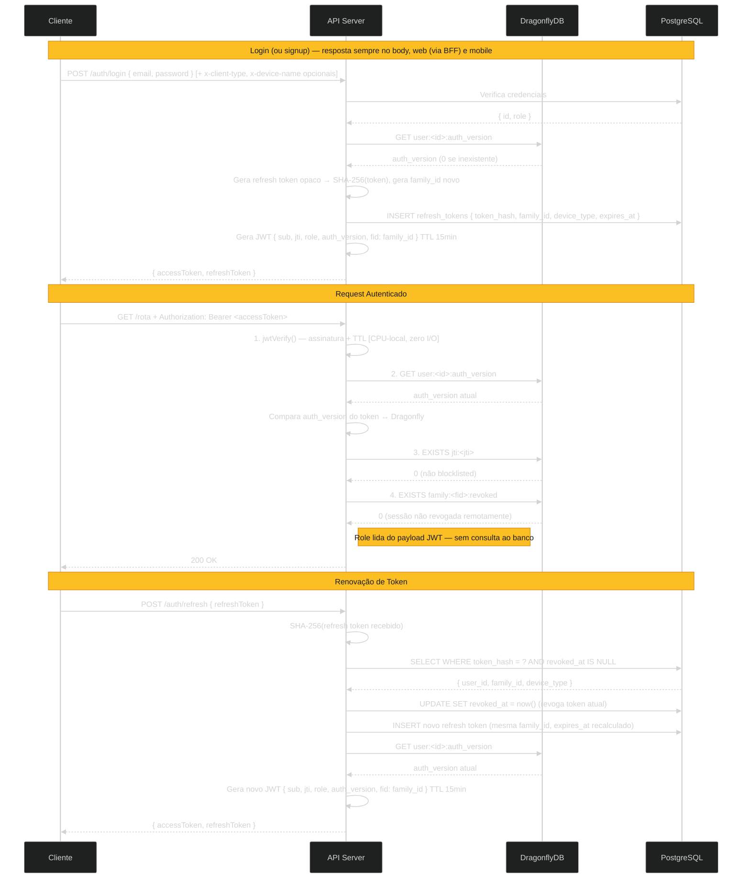
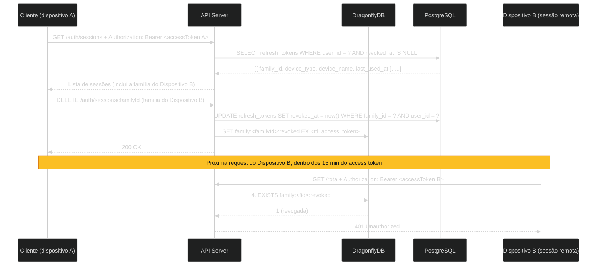

# [ADR-0023]: Estratégia de Autenticação: JWT Híbrido com Revogação via DragonflyDB

## Dados

- **Status:** 🔵 Em Uso
- **Data:** 2026-06-14
- **Proponentes:** [Allber Ferreira](https://github.com/AFSFerreira)

---

## Contexto e Problema

O MissionApp precisa de uma estratégia de autenticação que equilibre quatro requisitos que entram em tensão direta entre si:

**Revogação imediata de acesso (NF.1.3 — LGPD):**
O sistema armazena dados de afiliação religiosa, classificados como dados sensíveis pelo Art. 11 da LGPD. O titular tem direito à exclusão de dados e à revogação de consentimento a qualquer momento. Um token de acesso que permanece válido por horas após a solicitação de exclusão de conta é uma não-conformidade legal, não apenas uma falha técnica. O mesmo se aplica a contas de missionários reprovadas ou suspensas após aprovação (Req. 1.3, Req. 3.4): o acesso deve ser cortado imediatamente.

**Escalabilidade para picos de tráfego (NF.2.5 + NF.5.1):**
O sistema deve suportar 1.000 usuários simultâneos sem degradação superior a 20% no tempo de resposta. Domingos e cultos são janelas de alto tráfego previsíveis — feeds, contadores e projetos curados são acessados simultaneamente por uma grande base de usuários. A estratégia de autenticação deve escalar horizontalmente sem impor acoplamento entre as réplicas da aplicação.

**Operação em contexto mobile-first (NF.6.1):**
Missionários operam majoritariamente em campo, com acesso pelo celular. Clientes nativos (React Native, Flutter) não possuem cookie jar gerenciado pelo browser — cookies httpOnly exigem bibliotecas adicionais e configuração manual em cada plataforma, enquanto tokens no header `Authorization` são o padrão idiomático do OAuth 2.0 e de toda biblioteca HTTP mobile. A estratégia deve funcionar naturalmente em ambos os contextos sem impor overhead desnecessário ao cliente mobile.

**Segurança de conta em operações financeiras:**
O sistema intermedia doações financeiras entre apoiadores e missionários. Dispositivos comprometidos ou credenciais vazadas precisam de revogação imediata. A troca de senha deve invalidar todas as sessões ativas simultaneamente, não apenas a sessão corrente.

A questão central é: **qual estratégia de autenticação atende simultaneamente à conformidade LGPD, à escalabilidade horizontal, ao contexto mobile e à segurança de operações financeiras do MissionApp?**

## Decisão

Adotaremos **autenticação JWT híbrida** com dois tipos de token e revogação via DragonflyDB.

### Access Token (JWT — curta duração)

Token JWT assinado com HS256, emitido a cada login ou renovação, com TTL de 15 minutos. O payload carrega:

- `sub` — ID do usuário
- `jti` — UUID v7 único por token, utilizado para revogação individual (bloqueio do token corrente no logout)
- `auth_version` — contador de versão do usuário, utilizado para revogação global (todas as sessões)
- `fid` — `family_id` do refresh token emitido junto com este access token, utilizado para revogação remota de uma sessão/dispositivo específico
- `role` — role do usuário no momento da emissão (`ADMIN`, `MISSIONARY` ou `SUPPORTER`), utilizado para autorização sem consulta ao banco

Incluir a `role` no payload elimina o round-trip ao banco ou cache em cada verificação de permissão. A segurança é preservada pelo mecanismo de `auth_version`: qualquer alteração de role deve incrementar o contador, invalidando imediatamente todos os tokens emitidos com a role anterior.

A validação é realizada em quatro passos por request autenticado: verificação criptográfica da assinatura (`jwtVerify`), verificação da `auth_version` ativa no DragonflyDB, verificação da presença do `jti` na blocklist do DragonflyDB e verificação de que a `fid` não foi marcada como revogada remotamente. Todas são operações O(1) — a primeira é CPU-local, as três seguintes são `GET`/`EXISTS` independentes no DragonflyDB.

### Refresh Token (opaco — longa duração)

Token opaco gerado com `crypto.randomBytes(64)`. Armazenado no PostgreSQL como hash SHA-256 — o valor bruto nunca é persistido. Cada registro carrega:

- `token_hash` — hash SHA-256 do valor bruto
- `family_id` — UUID que agrupa todos os tokens de uma mesma sessão/dispositivo, utilizado para detecção de roubo via refresh token rotation e para revogação por-dispositivo
- `device_type` — `web` ou `mobile`, determina o TTL aplicado (ver abaixo) e é exibido na listagem de sessões
- `device_name` — nome legível do dispositivo/cliente (opcional, informado pelo cliente via header), exibido apenas na listagem de sessões
- `ip_address` — IP de origem da requisição que criou ou rotacionou o token
- `last_used_at` — data da última rotação bem-sucedida, usada para ordenar a listagem de sessões
- `expires_at` — expiração absoluta, recalculada a cada rotação (sliding window — ver abaixo)
- `revoked_at` — `null` enquanto válido; preenchido na revogação

**TTL por tipo de dispositivo, recalculado a cada rotação (sliding window):** o TTL não é um valor fixo desde a emissão original — a cada rotação bem-sucedida, `expires_at` é recalculado a partir do momento atual (`JWT_REFRESH_EXPIRES_IN_WEB`, padrão 7 dias; `JWT_REFRESH_EXPIRES_IN_MOBILE`, padrão 30 dias). Na prática: um app mobile usado diariamente nunca desautentica por inatividade, porque cada uso adia a expiração por mais 30 dias a partir daquele instante; só pede login novamente após um período real de inatividade maior que o TTL configurado. O TTL mais longo do mobile reflete o padrão observável de apps como Instagram e é adequado ao contexto mobile-first do MissionApp (NF.6.1) — sessões web (via BFF) usam um TTL mais curto por padrão de segurança.

A cada uso, o refresh token é rotacionado: o token apresentado é revogado e um novo é emitido na mesma família, com os metadados de dispositivo herdados e o TTL recalculado. Se um token já revogado for apresentado, toda a família é invalidada imediatamente — técnica conhecida como _refresh token rotation with family tracking_.

### Mecanismos de Revogação no DragonflyDB

**Revogação individual (bloqueio do access token corrente):**
O `jti` do access token corrente é adicionado ao DragonflyDB com TTL igual ao tempo restante de validade do token. A cada request, o guard verifica a existência da chave `jti:<valor>` antes de autenticar. Esse bloqueio é por natureza escopado a um único token — apenas o access token usado na requisição de logout é afetado.

**Revogação de sessão específica (logout de um dispositivo, ou revogação remota de outro dispositivo):**
O logout do dispositivo atual é escopado pela `family_id` do refresh token de origem daquela sessão (`fid` no payload do access token): `UPDATE refresh_tokens SET revoked_at = now() WHERE family_id = ? AND user_id = ?`, afetando apenas aquela sessão — outros dispositivos do mesmo usuário continuam válidos. O mesmo mecanismo é reutilizado para revogação remota: a partir da listagem de sessões ativas (`GET /auth/sessions`), o usuário pode encerrar remotamente qualquer sessão pelo seu `family_id` (`DELETE /auth/sessions/:familyId`), mesmo sem ter em mãos o access token daquele dispositivo. Nesse caso, o refresh token da família é revogado no PostgreSQL, mas o access token daquela sessão — se ainda dentro da janela de 15 minutos — só seria rejeitado organicamente na próxima tentativa de renovação. Para revogação efetivamente imediata, uma chave `family:<family_id>:revoked` é adicionada ao DragonflyDB com TTL igual ao tempo de vida máximo de um access token (`JWT_ACCESS_EXPIRES_IN`); o guard verifica essa chave a cada request (4º passo de validação), então o dispositivo remoto perde o acesso já na próxima requisição, não apenas ao tentar renovar.

**Revogação global (troca de senha, alteração de role, suspenção de conta, logout em todos os dispositivos):**
Um contador por usuário (`user:<id>:auth_version`) é incrementado no DragonflyDB. O payload do JWT carrega o valor da `auth_version` no momento da emissão. Se o valor no token divergir do valor atual no Dragonfly, o request é rejeitado — todos os tokens de todas as sessões ativas são invalidados instantaneamente, sem necessidade de enumerar os `jti`s emitidos. Isso garante que uma alteração de role nunca seja lida a partir de um token desatualizado. O mesmo mecanismo, combinado com `UPDATE refresh_tokens SET revoked_at = now() WHERE user_id = ?`, também implementa a ação explícita "sair de todos os dispositivos" (`DELETE /auth/sessions`) — distinta do logout comum, que afeta apenas a sessão corrente.

### Verificação de Credenciais — Mecanismos Internos do `withAuthFinder`

`User` compõe o mixin `AuthFinder` (`app/models/mixins/auth_finder.ts`), uma configuração fina em cima do `withAuthFinder` **oficial** do `@adonisjs/auth` (`@adonisjs/auth/mixins/lucid`) — não é código do projeto reimplementado do zero. Registrado aqui para consulta futura da equipe, já que os mecanismos de segurança que ele implementa não são óbvios lendo só a chamada de configuração:

**Proteção contra timing attack em `verifyCredentials(uid, password)`:** sem essa proteção, um servidor que só consulta o banco quando o usuário existe teria tempo de resposta mensuravelmente menor para "email inexistente" (falha imediata, sem hash) do que para "email existe, senha errada" (falha após um `hash.verify()`, operação Argon2 computacionalmente cara). Essa diferença de latência permite a um atacante enumerar emails cadastrados só medindo tempo de resposta — sem nunca ver uma mensagem de erro diferente. O mixin oficial fecha essa brecha: quando o usuário não é encontrado, ele mesmo assim executa um `hashFactory().make(password)` completo antes de lançar o erro — pagando o mesmo custo computacional de um `hash.verify()` real, para que "usuário não existe" e "senha errada" sejam indistinguíveis por tempo de resposta.

**`findForAuth(uids, value)`** — método estático que busca o usuário por qualquer uma das colunas configuradas em `uids` (`OR` entre elas). Usado internamente por `verifyCredentials`, e reaproveitado pelo override de `verifyCredentials` do `User` (ver seção "Bloqueio de Conta" abaixo) para obter o usuário mesmo em caminhos de falha.

**`verifyCredentials(uid, password)`** — orquestra `findForAuth` + verificação de senha, sempre lançando `errors.E_INVALID_CREDENTIALS` (nunca retorna `null`/`false`) em qualquer cenário de falha — usuário inexistente ou senha incorreta. Essa exceção é auto-gerenciada pelo AdonisJS: já vem com content negotiation (JSON, JSON:API, ou flash de sessão + redirect, dependendo do `Accept` da request) sem precisar de tratamento manual no controller.

**`verifyPassword(plainPassword)`** — método de instância que compara a senha em texto plano contra `password_hash` via `hash.verify()`. Usado tanto por `verifyCredentials` quanto por `validatePassword` (abaixo).

**`validatePassword(plainPassword, fieldName?)`** — método de instância usado no fluxo de "confirmar senha atual" (ex: troca de senha em `AccountPasswordController`). Ao contrário de `verifyCredentials`, lança um erro no formato de validação VineJS (422, com `field`/`rule`/`message`), não `E_INVALID_CREDENTIALS` (400) — adequado para reportar erro num campo específico de formulário, não uma falha de autenticação.

**Hook `hashPassword` (`@beforeSave()`)** — hashea automaticamente a coluna configurada em `passwordColumnName` (`password_hash`, neste projeto) sempre que ela estiver "suja" (alterada) antes de persistir. Por isso o restante da aplicação nunca chama `hash.make()` manualmente — só atribui a senha em texto plano (`user.passwordHash = novaSenha`) e chama `.save()`; o hook intercepta e hashea antes do `INSERT`/`UPDATE` real.

### Bloqueio de Conta por Força Bruta (Login Attempt Lockout)

Complementar ao `withAuthFinder`: um mecanismo de bloqueio temporário de conta após tentativas de login falhas consecutivas, para mitigar ataques de força bruta e credential stuffing contra o endpoint de login — algo que o mixin oficial não cobre (ele só resolve *uma* verificação segura, não *quantas* podem ser tentadas).

**Colunas em `users`:** `login_attempts` (contador de falhas consecutivas), `locked_at` (timestamp do último bloqueio; `null` = conta nunca foi bloqueada — mas não-nulo **não** significa bloqueada agora, ver decaimento abaixo) e `lock_count` (quantas vezes a conta já foi bloqueada; usado no cálculo de backoff).

**Política:** após `MAX_FAILED_LOGIN_ATTEMPTS` (5) tentativas falhas consecutivas, a conta é bloqueada por um período que dobra a cada novo bloqueio (backoff exponencial): `ACCOUNT_LOCK_BASE_SECONDS` (15s) × 2^(lock_count − 1), até o teto `ACCOUNT_LOCK_MAX_SECONDS` (24h). Progressão: 1º bloqueio 15s, 2º 30s, 3º 1min, 4º 2min... dobrando até travar em 24h. O período de bloqueio expira sozinho — não existe endpoint de desbloqueio manual; a próxima tentativa de login após a expiração já destrava a conta automaticamente e reseta `login_attempts`.

**Decaimento de `lock_count` (`LOCK_COUNT_DECAY_DAYS`, 1 dia):** sem decaimento, um erro de digitação isolado do dono legítimo — meses depois do último ataque real — herdaria o `lock_count` acumulado do incidente antigo e já cairia num bloqueio longo (ex: horas), o que é injusto para quem só errou a senha uma vez por descuido. Se o último bloqueio (`locked_at`) foi há mais de `LOCK_COUNT_DECAY_DAYS`, o próximo bloqueio reseta `lock_count` para 0 antes de incrementar — tratado como incidente isolado, não continuação de um ataque. `locked_at` nunca é zerado por `assertNotLocked`/`recordSuccess`: funciona como registro permanente do último bloqueio, usado exclusivamente por essa checagem de decaimento. "Conta bloqueada agora" é sempre calculado pela janela de tempo (`locked_at` + duração), nunca pela presença do campo.

**Onde a decisão de design foi mais deliberada — único ponto de entrada, mixin oficial intocado:** em vez de bifurcar a lógica de verificação de credenciais (um caminho "com lockout" para o controller de login, outro caminho "sem lockout" — o `verifyCredentials` cru do mixin — acessível a qualquer código futuro), `User` **sobrescreve** `verifyCredentials(uid, password)` mantendo exatamente o mesmo nome e assinatura do método original. A implementação sobrescrita chama `super.verifyCredentials()` para delegar a verificação criptográfica timing-safe (inalterada, ver seção anterior) ao mixin oficial, e envolve essa chamada com a política de bloqueio via `LoginAttemptService`. Resultado: **não existe uma segunda forma de verificar credenciais que ignore o lockout** — qualquer chamador, presente ou futuro, que use `User.verifyCredentials(...)` já ganha a proteção automaticamente, sem precisar saber que ela existe. A alternativa avaliada — reimplementar a lógica de verificação (busca + hash) direto num service, do jeito que padrões de referência de outros projetos costumam fazer — foi descartada por exigir reimplementar (e manter) a proteção contra timing attack descrita acima, hoje mantida pelo AdonisJS.

**`LoginAttemptService`** (`app/services/auth/login_attempt_service.ts`) — isola a política (limiar, cálculo de backoff, decaimento) do mecanismo de verificação: `assertNotLocked(user)` (lança se dentro da janela de bloqueio; não escreve nada quando o bloqueio já expirou — só a janela de tempo importa), `recordFailure(user)` (incrementa e bloqueia se atingir o limiar, aplicando o decaimento de `lock_count` quando cabível) e `recordSuccess(user)` (reseta apenas `login_attempts`; `locked_at`/`lock_count` permanecem como histórico do último bloqueio, usado pelo decaimento).

**`AccountLockedException`** (`app/exceptions/auth/account_locked_exception.ts`) — HTTP 423 (Locked), carrega `retryAfterSeconds` calculado a partir do horário de desbloqueio.

### Redefinição de Senha ("Esqueci Minha Senha")

`PasswordResetService` (`app/services/auth/password_reset_service.ts`) implementa o fluxo de recuperação de conta, reutilizando os mesmos mecanismos de revogação e bloqueio já descritos neste ADR em vez de introduzir lógica paralela:

**`requestReset(login)`** (`POST /auth/forgot-password`) — gera um token opaco (`crypto.randomBytes(32)`, `RESET_TOKEN_BYTES`), persiste em `users.recovery_password_token` como hash SHA-256 (mesma técnica do refresh token — valor bruto nunca é persistido) com validade de `RESET_TOKEN_TTL_MINUTES` (60min), e envia por email com o token bruto no link. Idempotente e silencioso quando o login não corresponde a um usuário cadastrado — nunca revela se um email existe (mitiga user enumeration).

**`resetPassword(rawToken, newPassword, ...)`** (`PATCH /auth/reset-password`) — localiza o usuário pelo hash do token apresentado, valida a janela de expiração, troca a senha (dispara o hook `hashPassword`, ver seção anterior) e então executa o **mesmo fluxo de "logout em todos os dispositivos"**: `AuthRevocationService.revokeAllSessions` (invalida todos os access tokens ativos via `auth_version` + revoga todos os refresh tokens) e `LoginAttemptService.recordSuccess` (destrava a conta, se bloqueada). Justificativa: apresentar um token de redefinição válido é prova de controle sobre o email cadastrado — equivalente em força a uma troca de senha autenticada, então recebe o mesmo tratamento de "reconquista de conta".

**`InvalidPasswordResetTokenException`** (`app/exceptions/auth/invalid_password_reset_token_exception.ts`) — lançada para token inexistente ou expirado; mensagem genérica de propósito (não distingue os dois casos, mesma lógica anti-enumeração de `verifyCredentials`).

### Entrega de Tokens

A API sempre retorna `accessToken` e `refreshToken` no corpo da resposta, em login, signup e refresh — independente do cliente. Não há mais entrega via cookie nesta camada.

**Motivo: o consumidor web não é um browser, é um BFF.**
O MissionApp é consumido na web por um BFF (Next.js), não diretamente por um browser — o browser fala com o BFF, e o BFF fala com esta API em uma chamada server-to-server. Um cookie setado por `response.cookie()` nesta API seria recebido pelo processo Node.js do BFF, não pelo browser do usuário final — o header `Set-Cookie` nunca atravessaria o hop BFF→browser automaticamente. Setar um cookie aqui seria, na melhor das hipóteses, inútil, e na pior, uma falsa sensação de segurança para quem lê o código sem entender a topologia real da requisição. A responsabilidade de expor um cookie httpOnly ao browser do usuário final é do BFF — ele recebe `{ accessToken, refreshToken }` no corpo desta API e decide como (e se) persistir isso para o navegador, via sua própria camada de sessão. Isso está fora do escopo desta API e deste ADR.

**Cliente mobile (app nativo):**
Continua recebendo ambos os tokens no corpo, como sempre — sem mudança. O app armazena ambos no storage seguro do sistema operacional: Keychain no iOS, Keystore no Android. JavaScript não está envolvido, portanto o vetor XSS não se aplica a este cliente.

**O que `x-client-type` ainda faz:**
O header `x-client-type: mobile` (ausente = `web`) deixou de controlar a entrega dos tokens — passou a ser puramente um sinal de metadado, usado para: (1) selecionar a política de TTL do refresh token (sliding window mais longa para mobile — ver seção "Refresh Token"); (2) popular `device_type` na listagem de sessões ativas (`GET /auth/sessions`). Um header opcional adicional, `x-device-name`, permite ao cliente informar um nome legível (`"iPhone 15"`, `"Chrome no macOS"`) exibido apenas nessa listagem.

### Fluxo Consolidado

```bash
Login:
  Verifica se a conta está bloqueada (LoginAttemptService.assertNotLocked)
    → se o bloqueio expirou, destrava automaticamente e segue
    → se ainda bloqueada, rejeita com 423 (AccountLockedException, retryAfterSeconds)
  Valida credenciais (User.verifyCredentials → delega ao AuthFinder oficial)
    → sucesso: reseta login_attempts (LoginAttemptService.recordSuccess); locked_at/
      lock_count permanecem como histórico, usados pelo decaimento em bloqueios futuros
    → falha: incrementa login_attempts; bloqueia a conta se atingir o limiar
      (LoginAttemptService.recordFailure)

Login (ou signup) — após credenciais válidas:
  Carrega { id, role } do usuário
  Cria refresh token opaco em nova família → armazena hash SHA-256 + device_type/
    device_name/ip_address no PostgreSQL (TTL por device_type, sliding window)
  Emite access token JWT (15 min) com payload { sub, jti, role, auth_version, fid }
  API-->>Cliente: { accessToken, refreshToken } — sempre no body, web e mobile
    (web é consumido por um BFF, não por um browser — ver "Entrega de Tokens")

Request autenticado:
  Authorization: Bearer <access_token>
  Guard (4 passos, todos O(1)):
    1. jwtVerify() [CPU-local] — valida assinatura e expiração
    2. GET user:<id>:auth_version [Dragonfly] — rejeita se divergir do payload
    3. EXISTS jti:<jti> [Dragonfly] — rejeita se token estiver na blocklist
    4. EXISTS family:<fid>:revoked [Dragonfly] — rejeita se a sessão foi revogada remotamente
  Role extraída do payload JWT — sem consulta ao banco para autorização

Access token expirado:
  POST /api/v1/auth/refresh { refreshToken }
  Servidor: SHA-256(refresh token recebido) → busca no banco → valida family_id
            → revoga token atual → cria novo refresh token na mesma família
              (TTL recalculado a partir de agora — sliding window)
            → emite novo access token com role, auth_version e fid atuais
  API-->>Cliente: { accessToken, refreshToken } — sempre no body

Logout (dispositivo atual):
  SET jti:<jti> EX <ttl_restante> [Dragonfly] → bloqueia o access token desta requisição
  UPDATE refresh_tokens SET revoked_at = now() WHERE family_id = ? AND user_id = ? [PostgreSQL]
     → apenas a sessão/família de origem; outros dispositivos não são afetados

Listar sessões ativas (GET /auth/sessions):
  SELECT refresh_tokens WHERE user_id = ? AND revoked_at IS NULL AND expires_at > now()
    ORDER BY last_used_at DESC [PostgreSQL] — uma linha por família ativa

Revogar sessão remota (DELETE /auth/sessions/:familyId):
  UPDATE refresh_tokens SET revoked_at = now() WHERE family_id = ? AND user_id = ? [PostgreSQL]
  SET family:<familyId>:revoked EX <ttl_access_token> [Dragonfly]
     → access token daquela sessão rejeitado já na próxima request (passo 4), sem
       esperar sua expiração natural

Logout em todos os dispositivos (DELETE /auth/sessions):
  INCR user:<id>:auth_version [Dragonfly] → invalida todos os access tokens imediatamente
  UPDATE refresh_tokens SET revoked_at = now() WHERE user_id = ? [PostgreSQL]

Troca de senha (autenticada, POST /account/password) ou redefinição via token
(esqueci minha senha, PATCH /auth/reset-password):
  Mesmo fluxo do logout em todos os dispositivos, via AuthRevocationService.revokeAllSessions
  + LoginAttemptService.recordSuccess (destrava a conta, se bloqueada)

Esqueci minha senha (POST /auth/forgot-password):
  Gera token opaco → SHA-256(token); grava hash + expiração em users [PostgreSQL]
  Envia email com o token bruto no link (idempotente/silencioso se o login não existir)

Alteração de role ou suspensão/reprovação de conta:
  Mecanismo de revogação global (AuthRevocationService.revokeAllSessions) está disponível
  para reuso aqui, mesmo fluxo do logout em todos os dispositivos — mas nenhum controller
  de administração de usuários existe ainda para disparar esse gatilho (feature futura,
  fora do escopo deste ADR)

Roubo de refresh token detectado (token revogado reutilizado):
  UPDATE refresh_tokens SET revoked_at = now() WHERE family_id = ? [PostgreSQL]
  → toda a família invalidada; ambas as partes forçadas a novo login com senha
```

### Diagrama de Sequência — Caminho Crítico



### Diagrama de Sequência — Revogação Remota de Sessão



## Justificativa

**JWT puro (sem blocklist) é incompatível com a LGPD e com os requisitos de segurança:**
Um JWT com TTL de 2 horas não pode ser revogado antes da expiração natural. Para o MissionApp, isso significa que: (1) um usuário que solicita exclusão de conta continua autenticado por até 2 horas — não-conformidade direta com o Art. 18 da LGPD; (2) um missionário suspenso após aprovação continua com acesso ativo pelo mesmo período; (3) um dispositivo comprometido com token ativo representa uma janela de exposição inaceitável em contexto que envolve transações financeiras. O requisito NF.1.3 não deixa espaço para tolerância nessa janela.

**Sessão stateful clássica impõe custos que o MissionApp não precisa pagar:**
Sessão stateful armazena estado para _todos_ os usuários ativos — cada request consulta o banco ou Redis para carregar a sessão. O MissionApp não possui o requisito de "uma sessão por vez por usuário" que justificaria esse custo em projetos SaaS com controle de licenciamento por assento. Além disso, sessão stateful em contexto mobile exige configuração explícita de cookie jar em cada cliente nativo, tornando a integração mais frágil e dependente de bibliotecas de terceiros.

**JWT híbrido captura o melhor dos dois modelos:**
O caminho crítico — cada request autenticado — é validado por operações O(1) sem tocar o PostgreSQL: verificação criptográfica local e um `GET` no DragonflyDB. A revogação existe, mas como exceção: a blocklist de `jti`s cresce apenas quando tokens são revogados antes da expiração, e a `auth_version` é um único campo por usuário. Em condições normais de operação, o banco relacional não é consultado em nenhum request de autenticação rotineiro.

**DragonflyDB já está no stack com custo de infra zero:**
O ADR-0007 adota o DragonflyDB para cache, rate limiting e broker de filas. A blocklist de `jti`s e os contadores de `auth_version` são mais dois usos do mesmo serviço — sem nova dependência, sem nova peça de infraestrutura para operar.

**Refresh token opaco no banco é o padrão da indústria para o modelo híbrido:**
Auth0, GitHub, Google OAuth 2.0 e a maioria dos grandes provedores de autenticação utilizam access token JWT de curta duração combinado com refresh token opaco de longa duração armazenado server-side. A razão é direta: o refresh token precisa ser revogável com garantia absoluta — o banco é autoritativo. O JWT para o access token elimina o lookup por request. A separação dos formatos é design deliberado, não inconsistência.

**Refresh token rotation com family tracking mitiga roubo de token:**
Independente de quem usa o token roubado primeiro, o mecanismo garante que ambas as partes perdem o acesso:

- **Usuário legítimo age primeiro:** usa RT_1 → recebe RT_2, RT_1 revogado. Atacante tenta RT_1 → servidor detecta reutilização de token revogado → invalida toda a família (RT_2 incluído) → ambos forçados a novo login com senha.
- **Atacante age primeiro:** usa RT_1 → recebe RT_2 (token do atacante), RT_1 revogado. Usuário legítimo tenta RT_1 → servidor detecta reutilização de token revogado → invalida toda a família (RT_2 do atacante incluído) → ambos forçados a novo login com senha.

Em ambos os cenários, o uso de um token já revogado é o gatilho da invalidação da família inteira. Sem rotation, um refresh token roubado seria utilizável pelo atacante até a expiração de 7 dias — sem que o servidor tivesse qualquer sinal de comprometimento.

**Entrega sempre via body simplifica a API sem reduzir segurança:**
A API não distingue mais o formato de entrega por tipo de cliente — todo cliente recebe `{ accessToken, refreshToken }` no corpo, sempre. Isso é possível porque o único consumidor "browser-like" da API (a aplicação web) na verdade fala com ela através de um BFF, nunca diretamente: o cookie httpOnly que protegeria o refresh token de um browser real é responsabilidade do BFF, que é quem efetivamente conversa com o navegador do usuário final. Do ponto de vista desta API, web e mobile são ambos clientes server-to-server ou app-nativo — nenhum dos dois é um browser executando JavaScript não confiável. O header `x-client-type` continua existindo, mas apenas como sinal de metadado (TTL por dispositivo, nome exibido na listagem de sessões), não mais como decisão de segurança.

**O modelo é estruturalmente resistente a XSS, e CSRF não se aplica a esta API:**

_XSS (Cross-Site Scripting):_ O vetor clássico de XSS contra autenticação é roubar um token persistido em `localStorage` e usá-lo para fazer requests em nome da vítima indefinidamente. Essa API nunca é exposta a esse vetor diretamente — ela não roda no browser do usuário final. A responsabilidade de proteger o access/refresh token de XSS no navegador é do BFF (ex: manter o access token em memória do servidor ou de um contexto não acessível a JavaScript de terceiros, e o refresh token em cookie httpOnly do próprio domínio do BFF) — está documentada na arquitetura do BFF, fora do escopo deste ADR. No cliente mobile, o refresh token vai para Keychain (iOS) ou Keystore (Android), storages isolados por app onde JavaScript sequer existe como superfície de ataque.

_CSRF (Cross-Site Request Forgery):_ CSRF explora o envio automático de cookies pelo browser em requests cross-origin. Esta API nunca seta um cookie — não há nada para o browser enviar automaticamente, então a superfície de CSRF contra ela é zero por construção, não por mitigação. Todos os endpoints autenticados exigem o header `Authorization: Bearer <token>`, que por si só já impediria CSRF mesmo se um cookie existisse (browsers não anexam headers customizados a requests cross-origin sem CORS explícito). A defesa contra CSRF no tráfego browser↔BFF é responsabilidade do BFF, que é quem eventualmente seta um cookie voltado ao navegador.

## Alternativas Consideradas

**1. JWT puro sem blocklist**

Descartado. Incompatível com NF.1.3 (LGPD — revogação de acesso ao solicitar exclusão), com os requisitos de suspenção de contas (Req. 1.3, 3.4) e com a necessidade de revogação em caso de dispositivo comprometido em contexto de transações financeiras. A janela de exposição de 15 minutos a 2 horas é inaceitável para os dados e operações envolvidos.

**2. Sessão stateful clássica (cookie de sessão + tabela de sessões)**

Descartada. O MissionApp não possui o requisito de "uma sessão ativa por usuário" que justificaria o custo de consultar a tabela de sessões em cada request. Em contexto mobile-first, cookies de sessão exigem bibliotecas adicionais e configuração não-idiomática. A sessão stateful impõe lookup no banco em todo request autenticado — custo que o modelo híbrido elimina do caminho crítico.

**3. JWT com blocklist de `jti` sem `auth_version`**

Parcialmente descartada. A blocklist de `jti` por si só não resolve a revogação em troca de senha de forma eficiente: seria necessário inserir no DragonflyDB todos os `jti`s de todos os tokens ativos do usuário, cuja contagem não é conhecida pelo servidor. O campo `auth_version` resolve esse problema com um único `INCR` — invalidando todos os tokens ativos sem enumeração.

**4. Opaque tokens para access e refresh (sem JWT)**

Descartado. Tokens opacos para access token exigem lookup no banco em cada request autenticado — o mesmo custo da sessão stateful. O benefício de ter acesso token autocontido (zero I/O no caminho crítico) seria perdido. O modelo híbrido preserva esse benefício enquanto adiciona revogação.

**5. Cookie `__Host-` em vez de `__Secure-`**

O prefixo `__Host-` proíbe o atributo `Path` e força `path=/`, tornando o cookie enviado para todos os endpoints da API — não apenas para `/api/v1/auth/refresh`. A restrição de `path` era uma camada de segurança relevante: reduzia a superfície de transmissão do refresh token. O `__Secure-` preservava a restrição de `path` e impunha HTTPS sem proibir `domain`.

**Nota de atualização:** esta alternativa ficou obsoleta com a adoção da arquitetura BFF — a API não seta mais nenhum cookie (ver seção "Entrega de Tokens"). Mantida aqui por completude histórica; o cookie httpOnly voltado ao navegador do usuário final, se necessário, é responsabilidade do BFF e está fora do escopo deste ADR.

**6. Better Auth (biblioteca de autenticação completa)**

Descartada. O Better Auth resolve bem o problema de quem está começando do zero sem saber como estruturar autenticação, mas o modelo deste ADR já é mais sofisticado do que o que a biblioteca entrega por padrão nos pontos que importam para o MissionApp. A rotation de refresh token com family tracking cobrindo os dois sentidos de roubo — atacante reutiliza o token primeiro ou usuário legítimo reutiliza primeiro, ambos invalidando a família inteira — não é comportamento padrão do Better Auth. A revogação global instantânea via `auth_version` (um único `INCR` no DragonflyDB, sem enumerar sessões) também não tem equivalente: o Better Auth revoga invalidando sessões na própria tabela, um lookup por usuário. A distinção mobile/web por `x-client-type` — refresh token no body para mobile, cookie httpOnly para web — não existe na biblioteca, que assume o browser como contexto primário. E a conformidade com a LGPD (revogação imediata em exclusão de conta, suspensão e troca de senha) não foi requisito de design do Better Auth; reproduzir esse comportamento exigiria customização extensiva por cima da abstração da biblioteca.

Há também um custo de integração real, embora secundário ao argumento acima: não existe adaptador Lucid para o Better Auth. Adotá-lo significaria rodar dois ORMs em paralelo ou escrever um adaptador do zero — qualquer uma das duas opções contraria a coesão que é o principal valor do AdonisJS como framework.

O Better Auth adicionaria valor genuíno em três frentes que este ADR não cobre — login social (OAuth, mais de 40 providers prontos), 2FA (TOTP ou SMS) e passkeys (WebAuthn) — mas nenhuma é requisito atual do MissionApp, e nenhuma justifica adotar a biblioteca inteira só para antecipá-las. Login social é resolvido pelo `@adonisjs/ally`, pacote oficial do ecossistema AdonisJS que se integra nativamente ao guard e ao `HttpContext` já existentes; 2FA pode ser adicionado como extensão do guard atual usando uma biblioteca TOTP como `otpauth`, sem abrir mão do modelo de revogação já construído. Multi-tenancy no sentido SaaS — organizações isoladas com seus próprios membros e permissões, o cenário em que o plugin de multi-tenancy do Better Auth faria sentido — também não se aplica: missionário e apoiador são roles dentro do mesmo sistema, não organizações separadas.

## Consequências (Trade-offs)

### Positivas / Benefícios

- **Conformidade com LGPD (NF.1.3):** Revogação imediata de acesso disponível em todos os cenários — logout, troca de senha, exclusão de conta, suspenção de conta. O mecanismo de `auth_version` corta o acesso na próxima request autenticada, não ao expirar o token.

- **Escalabilidade horizontal sem sticky sessions:** Nenhum estado de autenticação reside em memória do processo. DragonflyDB e PostgreSQL são compartilhados entre réplicas. O load balancer distribui requests livremente — não é necessário encaminhar o mesmo usuário sempre para a mesma instância.

- **Caminho crítico sem I/O no banco relacional:** Requests autenticados rotineiros não consultam o PostgreSQL. A `auth_version` é um `GET` no DragonflyDB. O banco é consultado apenas em eventos de baixa frequência: renovação do refresh token (a cada 15 minutos por usuário) e operações de revogação.

- **Suporte nativo a mobile e web com uma única API:** web (via BFF) e mobile recebem exatamente a mesma resposta — `{ accessToken, refreshToken }` no corpo. O header `x-client-type` diferencia apenas a política de TTL e os metadados de exibição, não o contrato da resposta.

- **Detecção de roubo de refresh token:** O mecanismo de rotation com `family_id` invalida automaticamente toda a linhagem da sessão comprometida quando um token revogado é reutilizado — sem intervenção manual e sem falso positivo para o usuário legítimo, que é forçado a fazer novo login com senha.

- **DragonflyDB reutilizado — zero adição de infraestrutura:** A blocklist de `jti`s, os contadores de `auth_version` e a blocklist de `family_id` são mais três namespaces no DragonflyDB já em operação. Não há nova peça de infraestrutura para provisionar, monitorar ou manter.

- **Logout corretamente escopado por dispositivo:** o logout comum afeta apenas a sessão/família de origem — outros dispositivos do mesmo usuário não são interrompidos. "Sair de todos os dispositivos" continua disponível como ação explícita e distinta (`DELETE /auth/sessions`), em vez de ser o comportamento implícito de todo logout.

- **Gerenciamento de sessões por dispositivo, estilo Google/Instagram:** o usuário pode listar todas as sessões ativas (dispositivo, IP, última atividade) e revogar remotamente qualquer uma delas — incluindo a de um dispositivo furtado ou esquecido logado, sem precisar trocar a senha (o que derrubaria também as sessões legítimas). A revogação remota é efetiva já na próxima request daquela sessão, não apenas na próxima tentativa de renovação.

- **TTL de refresh token adequado a cada contexto:** sliding window mais longa para mobile (30 dias por padrão) reduz o atrito de relogin em um app usado com frequência — mesma lógica observável em apps como Instagram — sem abrir mão de TTL mais curto por padrão para sessões web.

- **Proteção contra força bruta e credential stuffing no login:** bloqueio temporário com backoff exponencial após tentativas falhas consecutivas, imposto no único ponto de entrada de verificação de credenciais (`User.verifyCredentials`) — nenhum caminho de código, presente ou futuro, pode contornar a proteção sem saber que ela existe.

### Negativas / Riscos

- **DragonflyDB no caminho crítico de autenticação:** Cada request autenticado faz até três operações no DragonflyDB (`auth_version`, `jti`, `family_id`). Se o serviço estiver indisponível, o guard deve optar por _fail closed_ (rejeitar todos os requests) ou _fail open_ (aceitar todos os tokens válidos criptograficamente). Para o MissionApp, _fail closed_ é a posição segura dado o contexto de dados sensíveis e transações financeiras — mas impacta disponibilidade durante falha do DragonflyDB.

- **Janela de exposição de ≤ 15 minutos na troca de senha:** A `auth_version` invalida novos requests imediatamente, mas access tokens já emitidos e em uso em requests concorrentes naquele instante podem completar. Essa janela de até 15 minutos é a consequência direta do TTL curto e é considerada aceitável para os requisitos do MissionApp.

- **Complexidade operacional cresceu com o gerenciamento de sessões:** a estratégia agora envolve quatro mecanismos de revogação (jti, auth_version, family, e a própria tabela de refresh tokens) em vez de dois. Contribuidores precisam compreender a diferença entre "revogar uma família" (um dispositivo) e "incrementar auth_version" (todos os dispositivos) para implementar corretamente novos cenários — um erro comum seria usar o mecanismo global onde o escopado bastaria.

- **Tabela de refresh tokens requer manutenção periódica:** Tokens expirados e revogados acumulariam na tabela indefinidamente sem limpeza ativa. Implementado: `queue:refresh-tokens-cleanup` (`commands/queue_refresh_tokens_cleanup.ts`), worker BullMQ repetível (cron diário às 3h) que remove tokens expirados imediatamente e tokens revogados há mais de 30 dias (`REVOKED_RETENTION_DAYS`, `app/jobs/auth/purge_expired_refresh_tokens_job.ts`) — a janela de 30 dias preserva registros revogados recentemente para investigação forense de roubo de token (mesma `family_id` reutilizada).

- **Dependência de um BFF para a segurança do cliente web:** a API em si não protege mais o browser do usuário final contra XSS/CSRF — essa responsabilidade passou inteiramente para o BFF. Um BFF mal implementado (ex: expõe o refresh token para o client-side JavaScript em vez de mantê-lo apenas em cookie httpOnly do próprio domínio do BFF) reintroduziria os riscos que esta API deixou de tratar diretamente.

## Referências

- [RFC 6749](https://datatracker.ietf.org/doc/html/rfc6749): OAuth 2.0 Authorization Framework — base do modelo de tokens de acesso e atualização
- [RFC 7519](https://datatracker.ietf.org/doc/html/rfc7519): JSON Web Token (JWT) — especificação do formato e validação de access tokens
- [RFC 6265](https://datatracker.ietf.org/doc/html/rfc6265): HTTP State Management Mechanism — especificação de cookies e atributos `Secure`, `HttpOnly`, `SameSite`
- [MDN — Cookie prefixes](https://developer.mozilla.org/en-US/docs/Web/HTTP/Reference/Headers/Set-Cookie#cookie_prefixes): semântica e restrições dos prefixos `__Secure-` e `__Host-`
- [OWASP — Session Management Cheat Sheet](https://cheatsheetseries.owasp.org/cheatsheets/Session_Management_Cheat_Sheet.html): práticas de segurança para gestão de sessão e tokens
- [OWASP — XSS Prevention Cheat Sheet](https://cheatsheetseries.owasp.org/cheatsheets/Cross_Site_Scripting_Prevention_Cheat_Sheet.html): medidas de proteção contra XSS que fundamentam o uso de cookies httpOnly
- [OWASP — CSRF Prevention Cheat Sheet](https://cheatsheetseries.owasp.org/cheatsheets/Cross-Site_Request_Forgery_Prevention_Cheat_Sheet.html): medidas de proteção contra CSRF que fundamentam o uso de `SameSite=Strict`
- [MDN — Set-Cookie: SameSite](https://developer.mozilla.org/en-US/docs/Web/HTTP/Reference/Headers/Set-Cookie#samesitesamesite-value): comportamento de `SameSite=Strict` e proteção contra CSRF
- [RFC 9700 — seção 4.14](https://datatracker.ietf.org/doc/html/rfc9700#section-4.14): OAuth 2.0 Security Best Current Practice — base normativa para refresh token rotation e detecção de roubo via reuso de token revogado
- [Auth0 — Refresh Token Rotation](https://auth0.com/docs/secure/tokens/refresh-tokens/refresh-token-rotation): descrição aplicada do mecanismo de rotation with family tracking
- [Better Auth](https://www.better-auth.com/): biblioteca de autenticação avaliada e descartada como alternativa — ver seção "Alternativas Consideradas"
- [LGPD Art. 11](https://www.planalto.gov.br/ccivil_03/_ato2015-2018/2018/lei/l13709.htm): dados pessoais sensíveis — fundamento legal para revogação imediata de acesso
- [LGPD Art. 18](https://www.planalto.gov.br/ccivil_03/_ato2015-2018/2018/lei/l13709.htm): direitos do titular — inclui direito à exclusão e revogação de consentimento
- [ADR-0007](./0007-adocao-do-dragonfly-como-cache-e-armazenamento-temporario.md): decisão de adoção do DragonflyDB — justifica seu uso como armazenamento da blocklist e contadores de `auth_version`
- [ADR-0021 — Adoção de UUID v7 como Estratégia de Chave Primária](./0021-adocao-de-uuid-v7-como-estrategia-de-chave-primaria.md)
- [AdonisJS — Verifying User Credentials](https://docs.adonisjs.com/guides/authentication/verifying-user-credentials): documentação oficial do `withAuthFinder`, incluindo a proteção contra timing attack em `verifyCredentials`
- [OWASP — Credential Stuffing Prevention Cheat Sheet](https://cheatsheetseries.owasp.org/cheatsheets/Credential_Stuffing_Prevention_Cheat_Sheet.html): práticas de mitigação de força bruta e credential stuffing que fundamentam o bloqueio de conta
