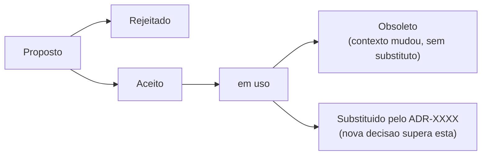

# 📋 Architecture Decision Records

> [!NOTE]
> Esta pasta é o **registro histórico imutável** das decisões arquiteturais do MissionApp Backend. Cada arquivo aqui explica **o quê foi decidido, por quê, e quais alternativas foram descartadas**.
>
> Se você quer entender por que o projeto foi construído de determinada forma, este é o lugar certo.

---

## 🧭 O que é um ADR?

Um **Architecture Decision Record** captura uma decisão arquitetural importante em um documento estruturado. Não descreve *como* o código funciona — descreve *por que* ele foi escrito daquela forma.

<div align="center">

<table width="100%">
   <colgroup>
      <col width="40%">
      <col width="60%">
   </colgroup>
   <thead>
      <tr>
         <th align="center">Seção</th>
         <th align="center">O que responde</th>
      </tr>
   </thead>
   <tbody>
      <tr>
         <td align="left"><strong>Contexto e Problema</strong></td>
         <td align="left">Qual era o problema ou necessidade?</td>
      </tr>
      <tr>
         <td align="left"><strong>Decisão</strong></td>
         <td align="left">O que foi escolhido?</td>
      </tr>
      <tr>
         <td align="left"><strong>Justificativa</strong></td>
         <td align="left">Por que essa opção e não outra?</td>
      </tr>
      <tr>
         <td align="left"><strong>Alternativas Consideradas</strong></td>
         <td align="left">O que foi avaliado e descartado?</td>
      </tr>
      <tr>
         <td align="left"><strong>Consequências (Trade-offs)</strong></td>
         <td align="left">Quais os impactos positivos e negativos?</td>
      </tr>
   </tbody>
</table>

</div>

> [!TIP]
> Leia os ADRs em ordem cronológica (`0000 → 0001 → ...`) para entender a evolução arquitetural do projeto. É a forma mais eficiente de fazer onboarding na arquitetura.

O formato adotado é baseado no modelo de [Michael Nygard (2011)](https://cognitect.com/blog/2011/11/15/documenting-architecture-decisions), com adaptações para o contexto open-source do MissionApp. A decisão de adotar ADRs está documentada no próprio [ADR-0000](./0000-uso-de-architecture-decision-records.md).

---

## ✅ Quando criar um ADR

Crie um ADR quando a decisão...

<div align="center">

<table width="100%">
   <colgroup>
      <col width="45%">
      <col width="55%">
   </colgroup>
   <thead>
      <tr>
         <th align="center">Categoria</th>
         <th align="center">Exemplos</th>
      </tr>
   </thead>
   <tbody>
      <tr>
         <td align="left">
            <strong>🏗️ Infraestrutura central</strong><br/>
            Introduz ou substitui banco de dados, ORM, sistema de filas, provedor de autenticação ou storage.
         </td>
         <td align="left">
            <ul>
               <li>Migrar de Lucid para Drizzle</li>
               <li>Adotar Redis para cache</li>
               <li>Usar S3 para imagens de posts</li>
            </ul>
         </td>
      </tr>
      <tr>
         <td align="left">
            <strong>📐 Padrões arquiteturais</strong><br/>
            Define ou altera estrutura de pastas, convenções de camadas, tratamento de erros, contrato da API.
         </td>
         <td align="left">
            <ul>
               <li>Adotar Repository Pattern</li>
               <li>Definir resposta padrão da API REST</li>
               <li>Versionar rotas</li>
            </ul>
         </td>
      </tr>
      <tr>
         <td align="left">
            <strong>🗄️ Modelo de dados</strong><br/>
            Cria ou altera entidades centrais, estratégia de relacionamentos, normalização vs. denormalização.
         </td>
         <td align="left">
            <ul>
               <li>Separar endereços em tabela própria</li>
               <li>Soft delete em entidades críticas</li>
               <li>Modelar projetos de impacto</li>
            </ul>
         </td>
      </tr>
      <tr>
         <td align="left">
            <strong>💸 Fluxo de negócio crítico</strong><br/>
            Muda o funcionamento de doações, autenticação de missionários, publicação de posts ou aprovação de campanhas.
         </td>
         <td align="left">
            <ul>
               <li>Migrar de JWT para sessão</li>
               <li>Alterar fluxo de aprovação de projetos de impacto</li>
            </ul>
         </td>
      </tr>
      <tr>
         <td align="left">
            <strong>📦 Dependência de alto acoplamento</strong><br/>
            Adiciona biblioteca ou serviço externo cuja remoção exigiria refatoração significativa.
         </td>
         <td align="left">
            <ul>
               <li>Provider de e-mail transacional</li>
               <li>Gateway de pagamento</li>
               <li>Lib de geração de PDF</li>
            </ul>
         </td>
      </tr>
      <tr>
         <td align="left">
            <strong>📏 Convenção global</strong><br/>
            Estabelece padrão que todos os colaboradores devem seguir — nomenclatura, testes, logging.
         </td>
         <td align="left">
            <ul>
               <li>Padrão de nomenclatura de arquivos e pastas</li>
               <li>Estratégia de testes adotada pelo projeto</li>
               <li>Formato de logs e observabilidade</li>
            </ul>
         </td>
      </tr>
   </tbody>
</table>

</div>

> [!IMPORTANT]
> **Em caso de dúvida:** se a mudança geraria debate em uma code review ou em uma issue, ela merece um ADR.

---

## ❌ Quando NÃO criar um ADR

Não é necessário um ADR para:

<div align="center">

<table width="100%">
   <colgroup>
      <col width="55%">
      <col width="45%">
   </colgroup>
   <thead>
      <tr>
         <th align="center">❌ Não cria ADR</th>
         <th align="center">✅ Onde registrar</th>
      </tr>
   </thead>
   <tbody>
      <tr>
         <td align="left">Correção de bugs</td>
         <td align="left">Issue + PR</td>
      </tr>
      <tr>
         <td align="left">Refatoração sem mudança de comportamento externo</td>
         <td align="left">PR com descrição clara</td>
      </tr>
      <tr>
         <td align="left">Adição de testes para código existente</td>
         <td align="left">PR</td>
      </tr>
      <tr>
         <td align="left">Ajustes de ferramentas de dev (ESLint, Prettier)</td>
         <td align="left">PR</td>
      </tr>
      <tr>
         <td align="left">Bump de versão sem breaking change</td>
         <td align="left">PR / Dependabot / RenovateBot</td>
      </tr>
      <tr>
         <td align="left">Otimização pontual (índice, query)</td>
         <td align="left">PR com justificativa no código</td>
      </tr>
      <tr>
         <td align="left">Decisões de UI/UX ou estilo visual</td>
         <td align="left">Repositório do frontend</td>
      </tr>
   </tbody>
</table>

</div>

---

## 🚀 Como propor uma decisão arquitetural

### 1. Abra uma Issue

Antes de escrever o ADR completo, abra uma issue descrevendo o problema. Permite discussão prévia e evita esforço desnecessário caso a direção seja descartada.

> [!TIP]
> Use a label **`architecture`** na issue para facilitar o filtro e o acompanhamento pelos gestores.

---

### 2. Copie o template

```bash
cp docs/architecture/templates/adr-template.md \
   docs/architecture/decisions/XXXX-nome-curto-da-decisao.md
```

Substitua `XXXX` pelo próximo número sequencial (verifique o último arquivo nesta pasta).

---

### 3. Preencha o ADR

<div align="center">

<table width="100%">
   <colgroup>
      <col width="35%">
      <col width="65%">
   </colgroup>
   <thead>
      <tr>
         <th align="center">Campo</th>
         <th align="center">Instrução</th>
      </tr>
   </thead>
   <tbody>
      <tr>
         <td align="left"><strong>Dados › Status</strong></td>
         <td align="left">Sempre <code>Proposto</code> no início</td>
      </tr>
      <tr>
         <td align="left"><strong>Dados › Proponentes</strong></td>
         <td align="left">Seu link de perfil do GitHub</td>
      </tr>
      <tr>
         <td align="left"><strong>Contexto e Problema</strong></td>
         <td align="left">Seja específico — cite entidades, rotas, arquivos quando relevante</td>
      </tr>
      <tr>
         <td align="left"><strong>Decisão</strong></td>
         <td align="left">Imperativo e objetivo: <em>"Adotaremos X"</em>, não <em>"Poderíamos X"</em></td>
      </tr>
      <tr>
         <td align="left"><strong>Justificativa</strong></td>
         <td align="left">Critérios técnicos que fizeram essa opção vencer</td>
      </tr>
      <tr>
         <td align="left"><strong>Alternativas Consideradas</strong></td>
         <td align="left">O que foi descartado e <strong>por quê exatamente</strong></td>
      </tr>
      <tr>
         <td align="left"><strong>Consequências</strong></td>
         <td align="left">Seja honesto com os negativos — um ADR só com benefícios é suspeito</td>
      </tr>
      <tr>
         <td align="left"><strong>Referências</strong></td>
         <td align="left">Link da issue de origem e documentação relevante</td>
      </tr>
   </tbody>
</table>

</div>

---

### 4. Abra um Pull Request

> [!IMPORTANT]
> O PR deve conter **apenas** o arquivo do ADR — sem código de implementação junto. A implementação vem depois, em PR separado, somente após o ADR ser aceito.

Use o título no formato:

```
docs(adr): ADR-XXXX — <título curto da decisão>
```

Adicione a label **`architecture`** e mencione a issue relacionada no corpo do PR.

---

### 5. Aguarde revisão e aprovação

ADRs de alto impacto precisam da aprovação de ao menos **um gestor do projeto** antes de serem marcados como `Aceito`.

```
PR aberto → Revisão e discussão → Aprovado → Status: Aceito → Implementação pode começar
```

---

## 🔄 Ciclo de vida de um ADR



> [!CAUTION]
> **ADRs aceitos nunca são editados retroativamente.** Se uma decisão muda, crie um novo ADR marcando o anterior como `Substituído pelo ADR-XXXX`. Reescrever um ADR aceito apaga o histórico e quebra a rastreabilidade — o principal valor deste processo.

---

## 📚 Índice de ADRs

<div align="center">

<table width="100%">
   <colgroup>
      <col width="15%">
      <col width="70%">
      <col width="15%">
   </colgroup>
   <thead>
      <tr>
         <th align="center">#</th>
         <th align="center">Título</th>
         <th align="center">Status</th>
      </tr>
   </thead>
   <tbody>
      <tr>
         <td align="center"><a href="./0000-uso-de-architecture-decision-records.md">ADR-0000</a></td>
         <td align="left">Adoção de Architecture Decision Records como Mecanismo de Documentação Arquitetural</td>
         <td align="center">🟡 Proposto</td>
      </tr>
   </tbody>
</table>

</div>
